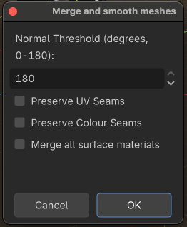
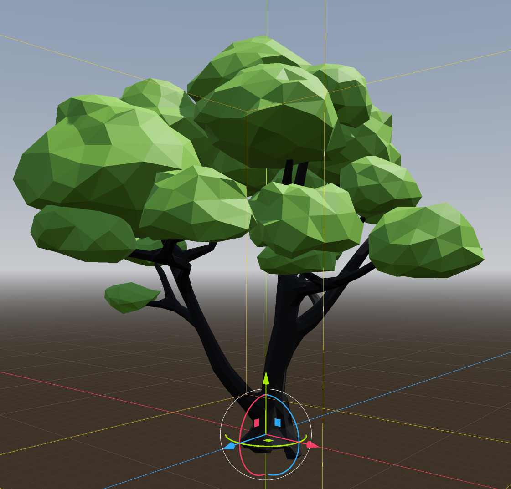
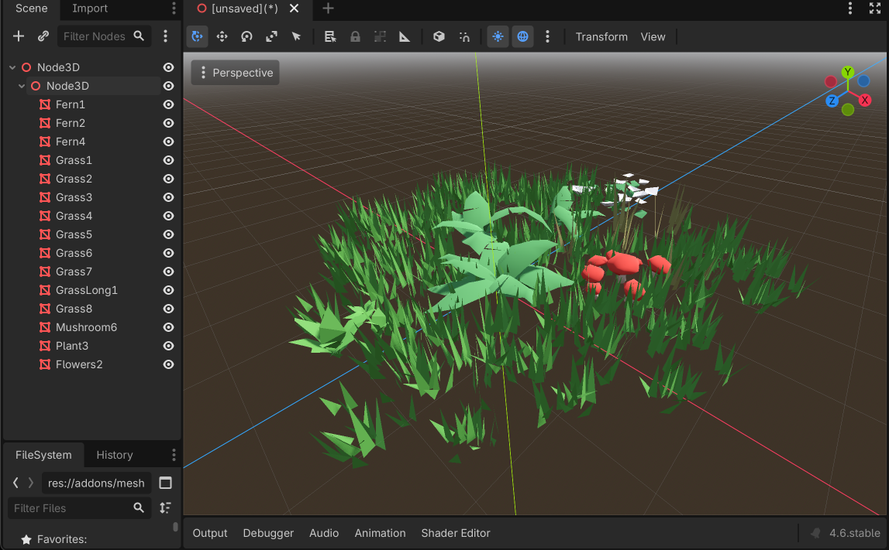
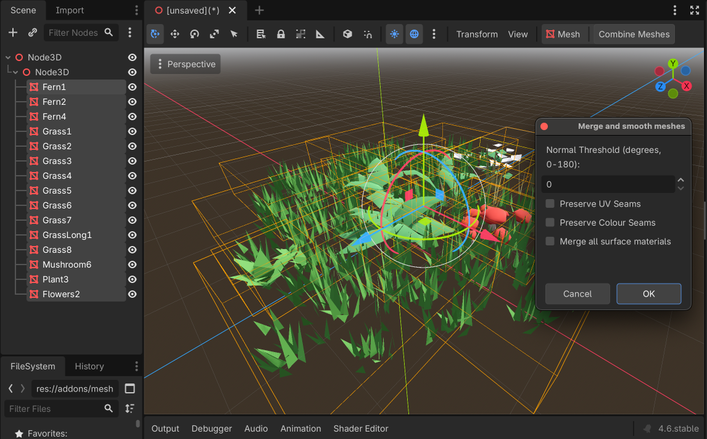
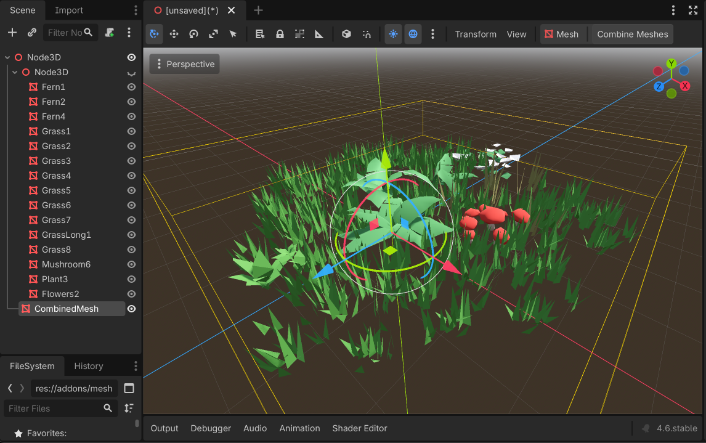

## Mesh Merge for Godot

A simple addon for Godot that can merge the selected MeshInstance3D's into a single new combined mesh.

The new mesh will have a single surface material for each unique material in the selected meshes.

### How to use.

1. Select all the MeshInstance3D's in your scene that you wish to combine into a single mesh.
2. A button will appear at the top of the viewport. Either press this button, or 
   choose `Project -> Tools -> Process Selected Meshes` from the menu to open the settings dialog.
3. Choose your settings and press OK. A new MeshInstance3D will be added to the scene that contains 
   all the geometry from the selected meshes.

Note that the original meshes will not be modified and will still be present in the scene. Typically
the new mesh and the old meshes occupy the same space, so you may need to hide or remove the original 
meshes to clearly see the results.

_The Dialog box_

### Options

**Normal Threshold**

When merging meshes, the tool can optionally rebuild normals. This feature is really designed for 
converting from flat shaded style geometry into smooth shaded meshes. This results in fewer verticies
as each vertex is shared by all connecting faces instead of being duplicated to support a unique normal
for each face. Set this to a high value (180 degrees) to merge every possible vertex and rebuild all the
normals, or a lower value (say 30 degrees) if you want to preserve some sharp edges. Set it to zero
to preserve the orginal selection of meshes unchanged.

**Preserve UV Seams**

When attempting to merge verticies for normal rebuilding (see above), the merging tool will also consider
the meshes UVs and avoid trying to merge verticies that share the same point in space, but have different UVs.

**Preserve Colour Seams**

Same as above, but also avoids merging verticies that share the same point in space, but have different vertex
colours.

**Merge All Surface Materials**

This will combine all selected MeshInstance3D's but only keep a single material for the whole lot (the first one
it finds). This can be helpful if many of your selected meshes are meant to have the same material (for example,
they all have the same settings), but they appear as many separate materials internally. This lets you easily
tidy them all up in a single step.

### Examples.

Meshes from [Green Stream](https://www.fab.com/listings/ce5cb0b2-0237-4dba-a7d2-25f6b168e242)

A example to show the mesh smoothing feature, taking a flat shaded tree mesh and turning it into a smooth shaded
tree mesh...

_before_

_after_

Another example, taking a cluster of grass, plant and flower meshes and merging them all into a single mesh...

_A scene with many meshes to make a new cluster of plants_

_Showing all the meshes selected and the dialog open_

_Finally, the original meshes have been hidden, leaving a single mesh containing everything_

Any bugs or queries, find me on Blue Sky at [@gamehooe.bsky.social](https://bsky.app/profile/gamehooe.bsky.social)
